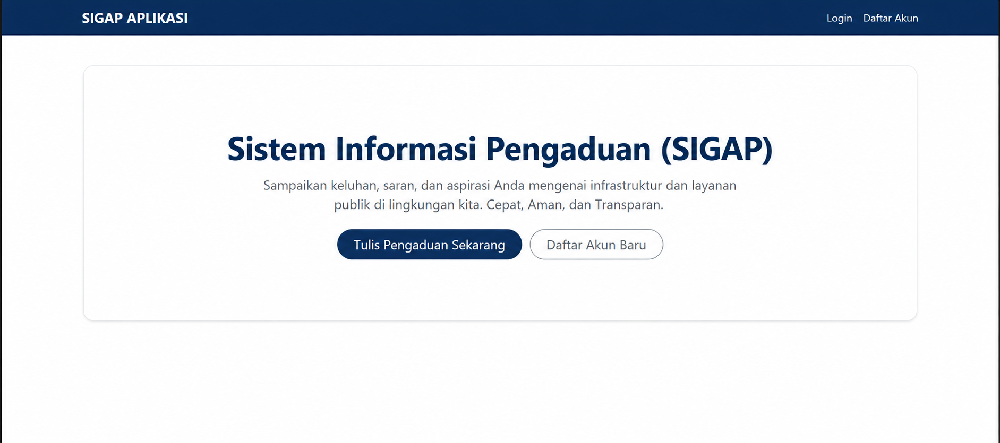
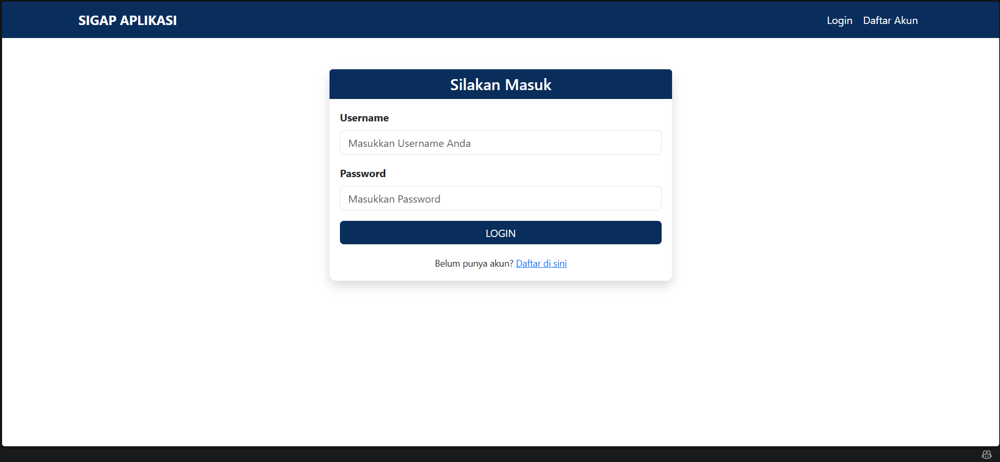
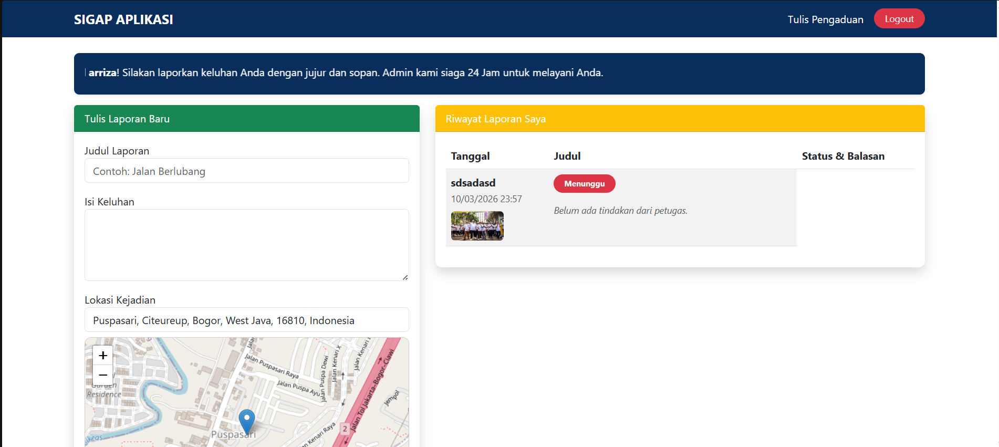
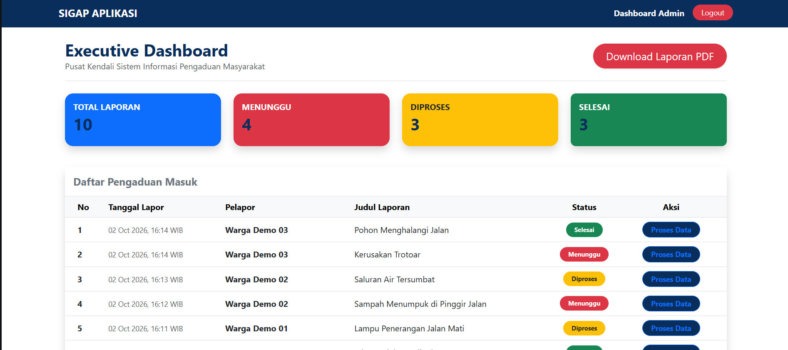
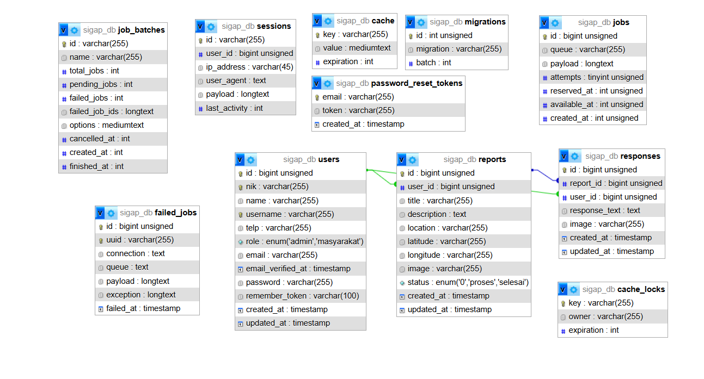

# SIGAP — Sistem Informasi Pengaduan Masyarakat

SIGAP adalah aplikasi web berbasis Laravel yang dibuat untuk membantu proses penyampaian dan pengelolaan pengaduan masyarakat secara terstruktur.

Aplikasi ini memiliki dua jenis pengguna, yaitu **masyarakat** dan **admin**. Masyarakat dapat membuat laporan pengaduan lengkap dengan deskripsi, foto, dan lokasi kejadian. Admin dapat melihat laporan masuk, memperbarui status laporan, memberikan tanggapan, serta mengunduh laporan dalam format PDF.

## Fitur Utama

- Login dan registrasi pengguna
- Role-based access untuk Admin dan Masyarakat
- Form pengaduan masyarakat
- Upload foto laporan
- Penentuan lokasi kejadian menggunakan Leaflet
- Riwayat laporan pengguna
- Status laporan: Menunggu, Diproses, dan Selesai
- Dashboard admin
- Pengelolaan laporan masuk
- Tanggapan admin terhadap laporan
- Timeline/status respons
- Export laporan ke PDF
- Progressive Web App (PWA)

## Tech Stack

- Laravel
- PHP
- MySQL
- Blade
- HTML
- CSS
- JavaScript
- Leaflet

## Screenshots

### Landing Page


### Login


### Form Pengaduan & Riwayat Laporan


### Admin Dashboard


### Database Structure


## Struktur Database

SIGAP menggunakan relational database dengan tabel utama:

- `users`
- `reports`
- `responses`

Relasi utama:

- User dapat membuat banyak laporan.
- Report dimiliki oleh satu user.
- Report dapat memiliki tanggapan dari admin.
- Response terhubung dengan report dan user/admin yang memberikan tanggapan.

## Instalasi

Clone repository:

```bash
git clone https://github.com/D4RY3LL/sigap-pengaduan-masyarakat.git
cd sigap-pengaduan-masyarakat